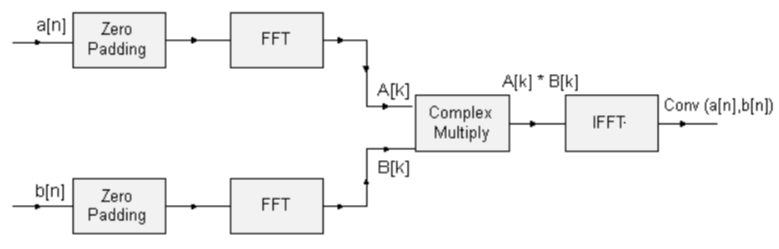

[Click here](../README.md) to view the README.

## Design and implementation

The design of this application is minimalistic to get started with code examples on PSOC&trade; Edge MCU devices. All PSOC&trade; Edge E84 MCU applications have a dual-CPU three-project structure to develop code for the CM33 and CM55 cores. The CM33 core has two separate projects for the secure processing environment (SPE) and non-secure processing environment (NSPE). A project folder consists of various subfolders, each denoting a specific aspect of the project. The three project folders are as follows:

**Table 1. Application projects**

Project | Description
--------|------------------------
*proj_cm33_s* | Project for CM33 secure processing environment (SPE)
*proj_cm33_ns* | Project for CM33 non-secure processing environment (NSPE)
*proj_cm55* | CM55 project

<br>

In this code example, at device reset, the secure boot process starts from the ROM boot with the secure enclave (SE) as the root of trust (RoT). From the secure enclave, the boot flow is passed on to the system CPU subsystem where the secure CM33 application starts. After all necessary secure configurations, the flow is passed on to the non-secure CM33 application. Resource initialization for this example is performed by this CM33 non-secure project. It configures the system clocks, pins, clock to peripheral connections, and other platform resources. It then enables the CM55 core using the `Cy_SysEnableCM55()` function and the CM55 core is subsequently put to DeepSleep mode.

This code example uses the CM55 as primary CPU. It utilizes the complex mathematical functions provided by the CMSIS_DSP library.

In the *Makefile* of the CM55 project, `CMSIS_DSP` is added to the `COMPONENTS` to include the DSP library and in case of `GCC_ARM` toolchain, `ARM_MATH_AUTOVECTORIZE` is added to `DEFINES` to allow the compiler to perform auto-vectorization of the DSP instructions. These variables are added to the *Makefile* as shown:

```
COMPONENTS+= CMSIS_DSP
ifeq ($(TOOLCHAIN),GCC_ARM)
DEFINES+=ARM_MATH_AUTOVECTORIZE
endif
```

**Algorithm (Convolution theorem)** 

The convolution theorem states that convolution in the time domain corresponds to multiplication in the frequency domain. Therefore, the Fast Fourier Transform of the convolution of two signals is equal to the product of their individual Fourier transforms. The Fourier transform of a signal can be evaluated efficiently using the Fast Fourier Transform (FFT).

Two input signals, a[n] and b[n] with lengths n1 and n2 respectively are zero padded so that their lengths become N, which is greater than or equal to (n1+n2-1) and is a power of 4 as FFT implementation is radix-4. The convolution of a[n] and b[n] is obtained by taking the FFT of the input signals, multiplying the Fourier transforms of the two signals, and taking the inverse FFT of the multiplied result.

This is denoted by the following equations:   
A[k] = FFT(a[n],N)   
B[k] = FFT(b[n],N)   
conv(a[n], b[n]) = IFFT(A[k] * B[k], N)   
Where, A[k] and B[k] are the N-point FFTs of the signals a[n] and b[n] respectively. The length of the convolved signal is (n1+n2-1).

**Block diagram**



**CMSIS DSP software library functions** 
 - arm_fill_f32( )
 - arm_copy_f32( )
 - arm_cfft_radix4_init_f32( )
 - arm_cfft_radix4_f32( )
 - arm_cmplx_mult_cmplx_f32( )

<br>